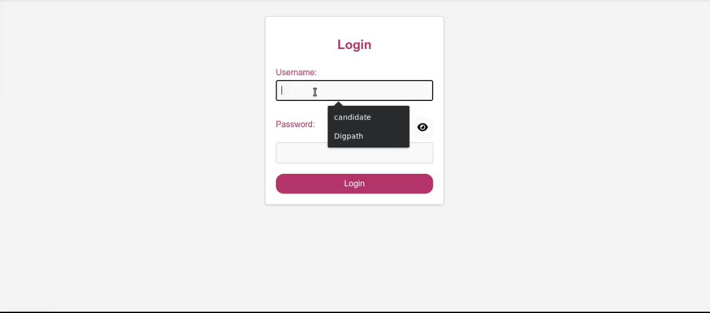
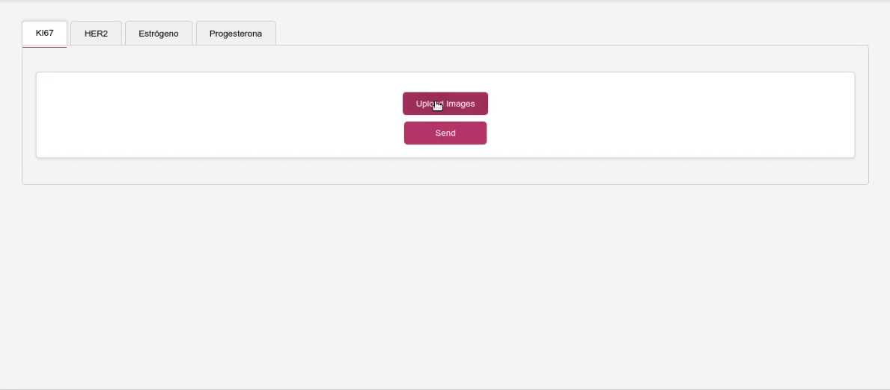
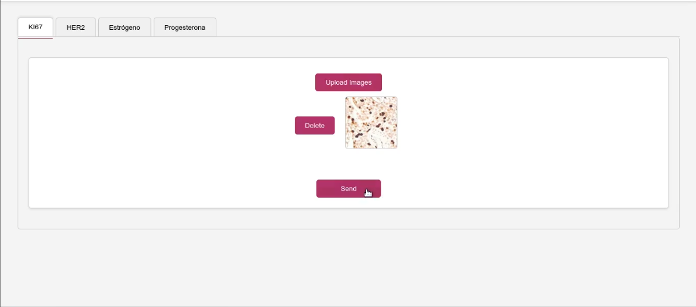

# Next.js Components

## Descripción

Este proyecto es una aplicación Next.js que incluye un modal de inicio de sesión y otros componentes que han sido adaptados para ejecutarse en un contenedor Docker. A continuación, se describen los cambios realizados y se proporcionan comparaciones visuales.

## Características

- **Inicio de sesión modal**: Un componente modal para iniciar sesión con campos para nombre de usuario y contraseña.
- **Cambio de contraseña visible**: Un icono de ojo para mostrar/ocultar la contraseña.

## Cambios Realizados

### 1. Modal de Inicio de Sesión

Se ha agrandado la letra y definido un color secundario para mejor armonia. Se le ha puesto un fondo al login para hacerlo mas amigable

**Antes:**

- La pantalla no contaba con un fondo ademas de usar siempre el mismo color haciendo que la pagina carezca de calidez

**Después:**

- Se ha creado un modal con campos para nombre de usuario y contraseña.
- Se ha añadido un fondo para que el usuarios se sienta mas comodo.
- Se ha definido como color secundario el #D9668D.

**Captura de Pantalla:**

### 2. Configuración de Docker

Se ha configurado Docker para el despliegue de la aplicación.

- Se ha añadido un archivo `Dockerfile` para construir la imagen Docker.
- Se ha creado un archivo `docker-compose.yml` para simplificar la administración de contenedores.

### 3. Pantalla Carga de imagenes

**Antes:**

- La pantalla lucia mas rigida y fria manejandose casi en su totalidad por los grises ademas de no resaltar tanto donde es que el usuarios esta parado
- Los datos que llegaban de la IA eran dificiles de entender.
- Al cargar mas imagenes se ponia una abajo de la otra.

**Despues:**

- Se definio un diseño en figma que fuera mas amigable y que ademas se diera un feedback mas inmediato de donde se esta ademas de agrandar la tipografia y el ancho der los botones
- Se separo los datos ademas de darle su propio espacio a cada uno y unificar los nombres para evitar confuciones
- Se implemento los tags como ficheros parecido a lo que tenian arriba para que cada imagen tenga su lugar y pueda acceder por separado

